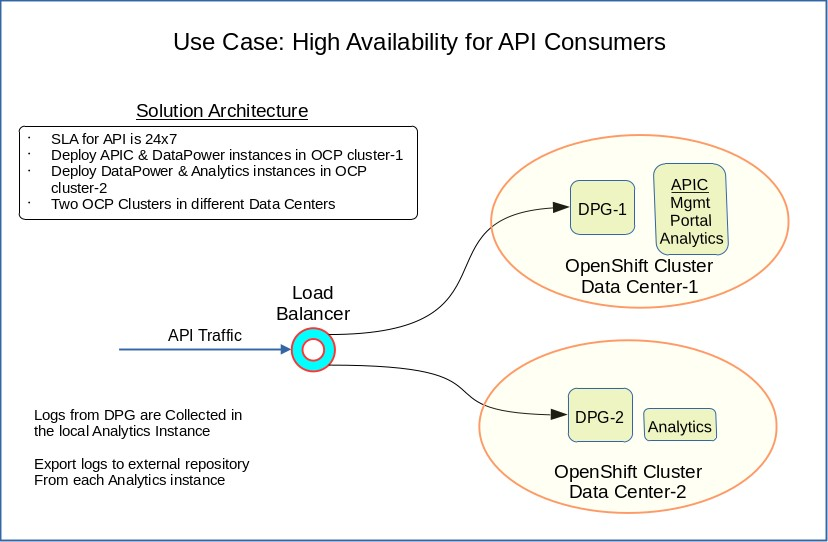

# IBM API Connect  
> ## High Availability with Two Data Centers  
>  Ravi Ramnarayan   
>  &copy; IBM v1.5  2023-01-11   

## Goals
- Compare High Availability (HA) architectures for IBM API Connect **v10** (APIC) on OpenShift   
  - [Two Data Center High Availability (2DCHA)](#1-two-data-center-high-availability-2dcha--ibm-docs)  
  - [APIC + DataPower in DC1 & DataPower in DC2](#2-apic--datapower-in-dc1--datapower-in-dc2-this-document)
- Outline steps to implement [APIC + DataPower in DC1 & DataPower in DC2](#implementation-apic--datapower-in-dc1--datapower-in-dc2)    

## Prologue  
The data centers could be *on premises* or vendor sites. Ideally, the data centers should be in different locations with separate lines for power and communication.   

### Tabled for a later discussion  
Modern cloud vendors can provide a variation which might be less expensive. APIC subsystems comprise three pods in *Production* deployments. Within a single OCP cluster, each pod could run in different *regions* (vendor nomenclature vary). The subsystems will operate even if one region fails as two active pods provide adequate quorum.  

## APIC Architecture  
We compare two APIC High Availability architectures using the metrics *Recovery Time Objective (RTO)* and *Recovery Point Objective (RPO)*. Please see [Planning your deployment topology](https://www.ibm.com/docs/en/api-connect/10.0.5.x_lts?topic=deployment-planning-your-topology).   

> **Recovery Point Objective (RPO)**  
>  The RPO measures how far back in time the recovery point is, and therefore how much new data is lost. An **RPO of zero** would assert that no data is lost, but such a solution is often a **compromise against the cost and performance** of the system.

### 1. Two Data Center High Availability (2DCHA)  *IBM Docs*  


#### Pro  
- High Availability (HA) for API traffic  
  With adequate capacity, the DPG cluster in a single DC could hand the full load if the other DC fails.  
- RPO for API Products  
  Near zero RPO for published API Products.  
- RPO for Consumer Subscriptions  
  Near zero RPO for Consumer Subscriptions. If the business requires near zero RPO, the [Two data center deployment strategy on Kubernetes and OpenShift](https://www.ibm.com/docs/en/SSMNED_10.0.5/com.ibm.apic.install.doc/planning_2dcdr_k8s_ocp.html) is the appropriate choice.  
- *RTO Failover*   
  If the *active* APIC cluster fails, it is possible to activate APIC on the other cluster in a short period. APIC functions cannot be performed until the completion of *RTO Failover*.   
  - Consumer Organizations cannot initiate new Subscriptions   
  - Provider Organizations cannot publish or update API Products   

#### Contra  
- Maintenance  
  Typically, APIC upgrades occur three or four times a year. Each upgrade bears the burden of increased time and effort.       
  - [Maintaining a two data center deployment](https://www.ibm.com/docs/en/SSMNED_10.0.5/com.ibm.apic.install.doc/capic_2siteha_maintain_k8s.html) is complex  
  - [Upgrading a two data center deployment](https://www.ibm.com/docs/en/SSMNED_10.0.5/com.ibm.apic.install.doc/capic_2siteha_upgrade_k8s.html) specifies operations on **both** OCP clusters within the **same** change window    
- *RTO to restore 2DCHA* requires Disaster Recovery (DR)     
  The goal of DR is to restore 2DCHA, which is different from *RTO Failover*. DR processes need to be aware of the *active* APIC site, adding complexity.       
- Costs  
  Software license and operational costs might be higher than the other architectures. Please verify specifics for your installations.  

### 2. APIC + DataPower in DC1 & DataPower in DC2 *This Document*   

  

#### Pro  
- High Availability (HA) for API traffic  
  Same HA level as the 2DCHA architecture.  
- RPO for API Products  
  It is possible to achieve *near zero* RPO tolerance with a backup soon after publishing products.  
- Maintenance   
  - Upgrade of APIC & DPG in DC1 using the *top level* APIConnectCluster Custom Resource (CR) requires less effort than upgrading APIC subsystems of the 2DCHA deployment
  - DPG & Analytics subsystems in DC2 can be upgraded in a **separate change window**  
    Starting with APIC v10.0.5.x, all fixpacks (fourth position) of APIC will be compatible with DPG v10.5.0.x. The flexibility allows a relaxed schedule to upgrade DC2.     
- Disaster Recovery (DR)   
  The process is less complex than DR for 2DCHA and should to be quicker to complete.   
- Costs  
  Software license and operational costs might be lower than for 2DCHA. Please verify specifics for your installations.  

#### Contra  
- RPO for *Consumer Subscriptions* depends on the frequency of backups
  It is possible to capture backups frequently, but RPO will not be comparable to 2DCHA's *near zero* tolerance for Consumer Subscriptions.    
- RTO depends on DR  
  The recovery time can be reduced with automation and DR drills. However, it is likely to take longer than the *RTO Failover* enabled by 2DCHA. APIC functions cannot be performed until DR restores normal service.   
  - Consumer Organizations cannot initiate new Subscriptions   
  - Provider Organizations cannot publish or update API Products  

## Implementation: APIC + DataPower in DC1 & DataPower in DC2   

> ***Note***: The steps below assume a *connected* OCP. Adjust as needed for *air-gapped* OCP.     

- *Connected* OCP  
Use [Installing operators](https://www.ibm.com/docs/en/api-connect/10.0.5.x_lts?topic=installation-installing-operators)   
- *Air-gapped* OCP  
Use the appropriate recipe in [Air-gapped installation](https://www.ibm.com/docs/en/api-connect/10.0.5.x_lts?topic=openshift-air-gapped-installation).  


### APIC + DataPower in  DC1   
Start with [Installing API Connect](https://www.ibm.com/docs/en/api-connect/10.0.5.x_lts?topic=integration-installing-api-connect) and follow the trail to [Installing with the top-level CR on OpenShift](https://www.ibm.com/docs/en/api-connect/10.0.5.x_lts?topic=integration-installing-top-level-cr-openshift).

### DataPower + Analytics in DC2  
[Installing with subsystem CRs in different namespaces or environments](https://www.ibm.com/docs/en/api-connect/10.0.5.x_lts?topic=integration-installing-subsystem-crs-in-different-namespaces-environments) provides the overview. We will install DataPower and Analytics subsystems in DC2.    
- OCP in DC2 needs preparations such as `pull-secret` and the IBM Operator Catalog source.
- Install the API Connect, DataPower and Common Services operators in `apigw2` namespace in DC2     
  This is the same set of operators used to install APIC in DC1.  
- The versions of the operators in DC1 & DC2 must be the same      
- Make sure the DC2 cluster has the same certificates as APIC in DC1    
  See [Common Issuers & Gateway Secrets](#common-issuers--gateway-secrets).  


#### Namespace & Operators    
- Create a namespace, for example, `apigw2`   
  >***Note***: Follow your naming conventions. `apigw2` is just an example.  
- Install the *IBM API Connect* operator   
- Subscribe to the same channel as the parent APIC in DC1    

#### Common Issuers & Gateway Secrets   
Follow steps in [Installing the Gateway subsystem](https://www.ibm.com/docs/en/api-connect/10.0.5.x_lts?topic=environments-installing-gateway-subsystem) section **Before you begin**.    
- Clone `ingress-ca ` from the primary OCP in DC1      
  [Installing the Gateway subsystem](https://www.ibm.com/docs/en/api-connect/10.0.5.x_lts?topic=environments-installing-gateway-subsystem) section **Before you begin** Step 1. Detailed instructions are in [Extracting the Management ingress-ca certificates](https://www.ibm.com/docs/en/api-connect/10.0.5.x_lts?topic=environments-extracting-management-ingress-ca-certificates).  

  - Apply the extracted `ingress-ca` to the DC2 Project `apigw2`  
    `oc apply -f <your ingress-ca extract.yaml> -n apigw2`  
  - Get the complete name of `ingress-ca`  
    ```
    oc get secret | grep ingress-ca
    apis-minimum-ingress-ca                     kubernetes.io/tls                  3      16m
    ```  
    >***Note***: The secret name in your installation will be different.  
  
- Define Common issuers and Gateway secrets   
  Obtain YAML from [Installing the Gateway subsystem](https://www.ibm.com/docs/en/api-connect/10.0.5.x_lts?topic=environments-installing-gateway-subsystem) section **Before you begin** Step 2.
  
  - Edit the YAML and set the Issuer `spec.ca.secretName` to value above  
    See example [230-common-issuer-and-gateway-certs.yaml](scripts/230-common-issuer-and-gateway-certs.yaml) which sets `spec.ca.secretName` to `apis-minimum-ingress-ca`.
    ```
    apiVersion: cert-manager.io/v1
    kind: Issuer
    metadata:
      name: ingress-issuer
      labels: {
        app.kubernetes.io/instance: "management",
        app.kubernetes.io/managed-by: "ibm-apiconnect",
        app.kubernetes.io/name: "ingress-issuer"
      }
    spec:
      ca:
        secretName: apis-minimum-ingress-ca
    ```

  - Apply your YAML to Project `apigw2` in DC2    

    `oc apply -f <your-common-issuer-and-gateway-certs.yaml> -n apigw2`  

  - Confirm *issuers* were created and ready for use  
    ```
    oc get issuers -n apigw2  
    NAME                 READY   AGE
    ingress-issuer       True    13m
    selfsigning-issuer   True    13m
    ```
  - Confirm the creation of *gateway secrets*   
    >***Note***: "3" in the third column indicates three components in the TLS (good).  
    ```
    oc get secrets -n apigw2 | grep gateway    
    gateway-peering                             kubernetes.io/tls                  3      24s
    gateway-service                             kubernetes.io/tls                  3      24s
    ```   

#### Deploy DataPower Gateway in `apigw2`   
- Create Gateway *admin secret*   
  You could use the same password as in the DC1 OCP or assign a different value. Create the secret in DC2 `apigw2`:  
  ```
  oc -n apigw2 create secret generic <gw_admin_secret_name> \
    --from-literal=password=<gw_admin_pswd>  
  ```

- Define the APIGW Gateway    
  Copy the YAML from [Installing the Gateway subsystem](https://www.ibm.com/docs/en/api-connect/10.0.5.x_lts?topic=environments-installing-gateway-subsystem) section **Procedure** Step 2. Use values appropriate to your installation. Recommend following naming conventions in DC1.    
  - **$** fields  
  - `metadata.name`  
  - `metadata.labels.app.kubernetes.io/name`  
  - `spec.adminUser.secretName` should be `<gw_admin_secret_name>`, which you created in the previous step    
  
  See **Example Values** in [250-apigateway_cr.yaml](scripts/250-apigateway_cr.yaml).  
  
    >***Note***:  Example values are NOT shell script substitutions. You should edit the file manually.  

  oc apply -f <your-apigateway_cr.yaml> -n apigw2`  

  It takes about five minutes to create the GatewayCluster.     

- Is the gateway running?    
  `oc get GatewayCluster -n apigw2`  

- Is the Gateway Management endpoint active?  
  `curl -k https://<spec.gatewayManagerEndpoint.hosts.name>/health`  
  should return:  
  `{"status":"ok"}`  

- Register DC2 Gateway Service in the parent DC1 APIC  
  Obtain URL for endpoints from OCP Routes in project `apigw2`.

#### Deploy Analytics in `apigw2`   
Deploy the Analytics subsystem in DC2 within the same namespace as the DataPower Gateway. The steps in [Installing the Analytics subsystem](https://www.ibm.com/docs/en/api-connect/10.0.5.x_lts?topic=openshift-installing-analytics-subsystem) are similar to [Installing the Gateway subsystem](https://www.ibm.com/docs/en/api-connect/10.0.5.x_lts?topic=environments-installing-gateway-subsystem).   

- Common Issuers  
  Nothing to do. Been there, done that in [Common Issuers & Gateway Secrets](#common-issuers--gateway-secrets). Skip over [Installing the Analytics subsystem](https://www.ibm.com/docs/en/api-connect/10.0.5.x_lts?topic=openshift-installing-analytics-subsystem) section **Before you begin**.    

- Obtain YAML from [Installing the Analytics subsystem](https://www.ibm.com/docs/en/api-connect/10.0.5.x_lts?topic=openshift-installing-analytics-subsystem) section **Procedure**  Step 1.   

- Ensure `clientSubjectDN` in DC2 Analytics matches the  **Subject common name** of DC1 APIC CMC *Analytics ingestion keystore*.
  - In APIC 10.0.5.1, the *Analytics ingestion keystore* **Subject common name** is `a7s-ing-client`      
  - Modify `spec.ingestion.clientSubjectDN` to match  
    The sample file [280-analytics_cr.yaml](scripts/280-analytics_cr.yaml)  contains the correction.  

- Create the Analytics subsystem in DC2  
  `oc apply -f <your-analytics_cr.yaml> -n apigw2`  

- Is the Analytics subsystem running?    
`oc get AnalyticsCluster -n apigw2`  

- Register DC2 Analytics in the parent DC1 APIC   
- Associate DC2 Analtyics with the DC2 DataPower Service    

#### Troubleshoot   

If you encounter a `403 Forbidden` error while registering the Analytics Service, the cause is likely to be a mismatch of `clientSubjectDN`.  

- Find the pod named `mtls-gw`  
  ```
  $ oc get pod -n apigw2 | grep mtls
  analytics-mtls-gw-6bbc4cbfcc-gchhc                       1/1     Running     0             17m
  ```

- Do the logs show mismatched `clientSubjectDN`?   

  ```
  $ oc logs analytics-mtls-gw-6bbc4cbfcc-gchhc | grep 403 -A2 -B1

  10.254.20.1 - - [05/Dec/2022:23:08:36 +0000] "GET /_healthz HTTP/1.1" 200 2 "-" "kube-probe/1.23"
  2022/12/05 23:08:36 [warn] 12#12: *2106 [lua] access_by_lua(nginx.conf:56):7: rejected request because certificate subject 'CN=a7s-ing-client' did not match expected 'CN=a7s-ing-client,O=cert-manager', client: 10.254.12.1, server: ai.apps.fainted.myco.com, request: "POST /analytics-service-registration-create?admin=true&management=true HTTP/1.1", host: "ai.apps.fainted.myco.com"
  10.254.12.1 - - [05/Dec/2022:23:08:36 +0000] "POST /analytics-service-registration-create?admin=true&management=true HTTP/1.1" 403 159 "-" "axios/0.26.1"
  10.254.20.1 - - [05/Dec/2022:23:08:46 +0000] "GET /_healthz HTTP/1.1" 200 2 "-" "kube-probe/1.23"
  ```
- Fix the problem by changing the `clientSubjectDN` on the DC2 AnalyticsCluster  
  You can edit the AnalyticsCluster YAML and change `clientSubjectDN`.   


## References    
- [Certificate lists for Cloud Pak for Integration](https://www.ibm.com/docs/en/api-connect/10.0.5.x_lts?topic=certificates-certificate-lists-cloud-pak-integration)  
- [List of Issuers, CA certificates, and secrets](https://www.ibm.com/docs/en/api-connect/10.0.5.x_lts?topic=certificates-list-issuers-ca-secrets)  
