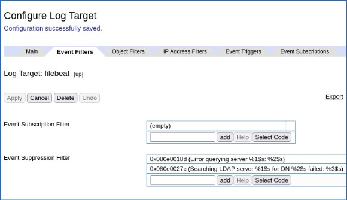
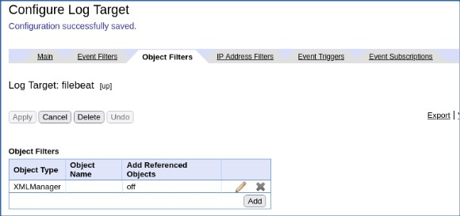
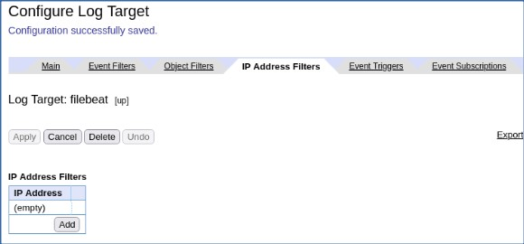
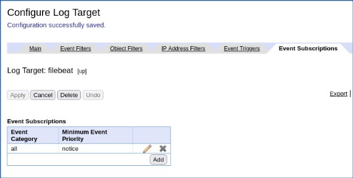

# DataPower Log Target without WebGUI - Example    
> Ravi Ramnarayan  
>  &copy; IBM v1.22  2022-04-03  

## Prolog
- This document is a bare bones example. Please refer to [DataPower Config without WebGUI](https://github.com/ibm-apiconnect/apic-hybrid-cloud-enablement/blob/master/docs-and-tools/datapower/DataPower-Config-without-WebGUI.md) for context and explanations.  
- The IBM Techcon 2021 session [Re-imagining DataPower in the container world](https://techcon2021.ibm.com/agenda/session/578106) explains steps to develop DataPower assemblies and configurations on your workstation. *You might have to register to access the recording or download slides.*  

## Steps
- [Setup DataPower on Docker](#setup-datapower-on-docker)  
- [Create Log Target using WebGUI](#create-log-target-using-webgui)
- [Isolate Log Target `config` statements](#isolate-log-target-config-statements)  
- [Define k8s/OCP ConfigMap & Inject DataPower Log Target](#define-k8socp-configmap--inject-datapower-log-target)  
  Inject Log Target `config` into operator Custom Resource (CR) YAML.  
    - **k8s** GatewayCluster CR  
    - **OCP** APIConnectCluster CR  

## Setup DataPower on Docker  

### Ubuntu 20 VM `ubu20`  
- Install Docker  
- Set up a local working environment  
  ```
  rramnara@ubu20:~$ mkdir dp-dev && cd dp-dev
  # setup directories for volume mounts
  rramnara@ubu20:~/dp-dev$ mkdir config local certs
  rramnara@ubu20:~/dp-dev$ chmod 777 config local certs
  rramnara@ubu20:~/dp-dev$ ll
  total 20
  drwxrwxr-x 5 rramnara rramnara 4096 Mar 15 20:19 ./
  drwxr-xr-x 9 rramnara rramnara 4096 Mar 15 20:37 ../
  drwxrwxrwx 2 rramnara rramnara 4096 Mar 15 20:19 certs/
  drwxrwxrwx 2 rramnara rramnara 4096 Mar 15 20:20 config/
  drwxrwxrwx 2 rramnara rramnara 4096 Mar 15 20:20 local/
  ```

- Start a container, mounting relevant directories (ex. config, local, certs)  
  >***Note***: `docker run` command contains `-p 9090:9090` which is **not** in [Re-imagining DataPower in the container world](https://techcon2021.ibm.com/agenda/session/578106) slide 9.

  ```
  docker run -it \
  -e DATAPOWER_ACCEPT_LICENSE=true \
  -e DATAPOWER_INTERACTIVE=true \
  -p 9090:9090 \
  -v $(pwd)/config:/opt/ibm/datapower/drouter/config \
  -v $(pwd)/local:/opt/ibm/datapower/drouter/local \
  -v $(pwd)/certs:/opt/ibm/datapower/root/secure/usrcerts \
  --name dp-dev \
  icr.io/integration/datapower/datapower-limited:10.0.3.0
  ```

  Produces about 30 lines of output. The last couple of lines should resemble:

  ```
  20220315T203900.823Z [0x8100003b][mgmt][notice] domain(default): Domain configured successfully.
  20220315T203901.071Z [0x00350014][mgmt][notice] quota-enforcement-server(QuotaEnforcementServer): tid(831): Operational state up
  ```

  - Access the container’s CLI, login with ‘admin’ user (default pw: admin)  

  ```
  login: admin
  Password: *****

  Welcome to IBM DataPower Gateway console configuration.
  Copyright IBM Corporation 1999, 2021

  Version: IDG.10.0.3.0 build 333705 on Jun 16, 2021 9:06:57 PM
  Delivery type: CD
  Serial number: 0000001
  ```

- Enable WebGUI  

  ```
  idg# co
  Global mode
  idg(config)# write mem
  Overwrite previously saved configuration? Yes/No [y/n]: y
  20220315T203939.267Z [0x8100000c][mgmt][notice] : tid(7174): Saved current configuration to 'config:///auto-startup.cfg'
  20220315T203939.271Z [0x81000040][mgmt][notice] domain(default): tid(7174): Domain configuration has been saved.
  20220315T203939.304Z [0x8100000c][mgmt][notice] : tid(111): Saved current configuration to 'config:///auto-user.cfg'
  Configuration saved successfully.
  idg(config)# web-mgmt; admin enabled; exit
  Modify Web Management Service configuration

  idg(config)# 20220315T203958.606Z [0x8100003f][mgmt][notice] domain(default): tid(303): Domain configuration has been modified.
  20220315T203958.609Z [0x00350014][mgmt][notice] web-mgmt(WebGUI-Settings): tid(303): Operational state up

  idg(config)# write mem
  Overwrite previously saved configuration? Yes/No [y/n]: y
  Configuration saved successfully.
  idg(config)# 20220315T204007.739Z [0x8100000c][mgmt][notice] : tid(7174): Saved current configuration to 'config:///auto-startup.cfg'
  20220315T204007.743Z [0x81000040][mgmt][notice] domain(default): tid(7174): Domain configuration has been saved.
  20220315T204007.761Z [0x8100000c][mgmt][notice] : tid(111): Saved current configuration to 'config:///auto-user.cfg'

  idg(config)# show web-mgmt

  web-mgmt [up]
  --------
   admin-state enabled
   ip-address 0.0.0.0
   port 9090
   save-config-overwrite on
   idle-timeout 600 Seconds
   acl web-mgmt  [up]
   ssl-config-type server
   enable-sts on

  idg(config)# exit
  idg# exit
  Goodbye.
  59ab55cf2bb1
  Unauthorized access prohibited.
  login:
  ```  

  >***Note***: Enter **Ctrl-PQ** to disengage from DataPower without killing the process.  

### Linux workstation  

- Download DataPower files to workstation  

  ```
  rramnara:DP-LogTarget$ mkdir dp-dev-0
  rramnara:DP-LogTarget$ cd dp-dev-0/
  rramnara:dp-dev-0$ scp -r rramnara@192.168.122.60:/home/rramnara/dp-dev/* ./
  webgui-privkey.pem                                   100% 1704   968.1KB/s   00:00
  webgui-sscert.pem                                    100% 1147     1.1MB/s   00:00
  default.cfg                                          100%   95   125.1KB/s   00:00
  auto-startup.cfg                                     100%   20KB  19.1MB/s   00:00
  auto-user.cfg                                        100%  293   158.1KB/s   00:00
  Chrystoki.conf                                       100% 1440     3.0MB/s   00:00
  rramnara:dp-dev-0$ ll
  total 12
  drwxrwxr-x. 2 rramnara rramnara 4096 Mar 15 16:44 certs
  drwxrwxr-x. 2 rramnara rramnara 4096 Mar 15 16:44 config
  drwxrwxr-x. 3 rramnara rramnara 4096 Mar 15 16:44 local
  rramnara:dp-dev-0$ tree -L 3
  .
  ├── certs
  │   ├── webgui-privkey.pem
  │   └── webgui-sscert.pem
  ├── config
  │   ├── auto-startup.cfg
  │   ├── auto-user.cfg
  │   └── default.cfg
  └── local
      └── luna_config
          ├── Chrystoki.conf
          ├── configData
          └── data

  6 directories, 6 files
  ```

## Create Log Target using WebGUI

### DataPower WebGUI  

- Define Log Target    

  

  

  

  

  

  

### Linux workstation  


- Download DataPower files to workstation   

  ```
  rramnara:DP-LogTarget$ mkdir dp-dev-2
  rramnara:DP-LogTarget$ cd dp-dev-2/
  rramnara:dp-dev-2$ scp -r rramnara@192.168.122.60:/home/rramnara/dp-dev/* ./
  webgui-privkey.pem                                   100% 1704     2.4MB/s   00:00
  webgui-sscert.pem                                    100% 1147     1.4MB/s   00:00
  default.cfg                                          100%   95   183.2KB/s   00:00
  auto-startup.cfg                                     100%   20KB  24.0MB/s   00:00
  auto-user.cfg                                        100%  293   517.4KB/s   00:00
  Chrystoki.conf                                       100% 1440     2.2MB/s   00:00
  rramnara:dp-dev-2$ ll
  total 12
  drwxrwxr-x. 3 rramnara rramnara 4096 Mar 16 10:06 certs
  drwxrwxr-x. 2 rramnara rramnara 4096 Mar 16 10:06 config
  drwxrwxr-x. 3 rramnara rramnara 4096 Mar 16 10:06 local
  rramnara:dp-dev-2$ tree -L 3
  .
  ├── certs
  │   ├── luna_cert
  │   ├── webgui-privkey.pem
  │   └── webgui-sscert.pem
  ├── config
  │   ├── auto-startup.cfg
  │   ├── auto-user.cfg
  │   └── default.cfg
  └── local
      └── luna_config
          ├── Chrystoki.conf
          ├── configData
          └── data

  7 directories, 6 files
  ```

## Isolate Log Target `config` statements  

### Linux workstation

- Isolate `config` changes  
  Compare `auto-startup.cfg` files.

  ```
  rramnara:DP-LogTarget$ diff dp-dev-0/config/auto-startup.cfg dp-dev-2/config/auto-startup.cfg
  3c3
  < # configuration fcdbe397c2b44f5fa3828d06078ba297 generated Tue Mar 15 16:40:07 2022; firmware version 333705
  ---
  > # configuration 01552a3f680641409c738d06078b0ee1 generated Wed Mar 16 09:55:05 2022; firmware version 333705
  179a180,214
  >
  > logging target "filebeat"
  >   summary "filebeat"
  >   type syslog
  >   priority normal
  >   soap-version soap11
  >   format text
  >   timestamp zulu
  >   fixed-format
  >   local-ident "xxx-yyy02"
  >   size 500
  >   archive-mode rotate
  >   upload-method ftp
  >   rotate 3
  >   no ansi-color
  >   remote-address "172.28.97.94" "1514"
  >   local-address 0.0.0.0
  >   facility user
  >   rate-limit 100
  >   connect-timeout 60
  >   idle-timeout 15
  >   active-timeout 0
  >   no feedback-detection
  >   no event-detection
  >   suppression-period 10
  >   event-filter 0x080e0018d
  >   event-filter 0x080e0027c
  >   object "XMLManager"
  >   ssl-client-type proxy
  >   retry-interval 1
  >   retry-attempts 1
  >   long-retry-interval 20
  >   precision microsecond
  >   event "all" "notice"
  > exit
  ```  

  Capture the output in a file, remove the lines above `logging target` and strip the leading `> `.
  ```
  sed 's/^> //' log-target-config.txt > log-target-configmap.cfg
  ```

## Define k8s/OCP ConfigMap & Inject DataPower Log Target

### API Connect-DataPower installation

This installation is on **k8s**.

- Create ConfigMap   

  ```
  kubectl create configmap datapower-logtarget-cfg \
  --from-file=./log-target-configmap.cfg -n dev  
  ```

- Create `additionalDomainConfig` file for DataPower on **k8s**

  ```
  spec:
    additionalDomainConfig:
    - name: "default"
      dpApp:
        config:
        - "datapower-logtarget-cfg"
  ```

- Patch DataPower **GatewayCluster** with additionalDomainConfig  

  ```
  kubectl patch gatewaycluster gwv6 --type merge \
  --patch-file='DP-LogTarget-k8s-additionalDomainConfig.yaml' -n dev
  ```

- Verify Log Target  
  You can examine the new `filebeat` Log Target in WebGUI or by logging into the DataPower. See [DataPower Config without WebGUI](https://github.com/ibm-apiconnect/apic-hybrid-cloud-enablement/blob/master/docs-and-tools/datapower/DataPower-Config-without-WebGUI.md) for details.

  - DataPower CLI  
    ```
    co;show logging target
    ```

  - DataPower WebGUI  
    Should be the same as in [Create Log Target using WebGUI](#create-log-target-using-webgui)
