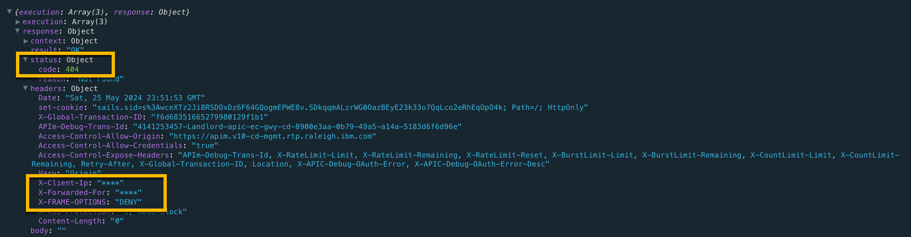

# Global Error Policy: Mask Sensitive Data   
> Sila Kissuu  
>  &copy; IBM v0.1  2024-05-24   

We demonstrate how to create and designate a global error policy. In this policy we mask the IP address returned in the X-Client-Ip response header.

## PROCEDURE

1. Create a global policy yaml file.

    Contents of the global_error_policy.yaml used in this document:

    ```yaml
    global-policy: 1.0.0
    info:
      name: mask-ip-error-policy
      title: Mask IP Error Policy
      version: 2.0.0
    gateways:
      - datapower-api-gateway
    assembly:
      catch:
        - errors:
            - AssemblyRateLimitError
            - RuntimeError
          execute:
            - log:
                title: log
                log-level: default
                mode: gather-only
                version: 2.1.0
        - default:
            - log:
                title: log
                log-level: default
                mode: gather-only
                version: 2.1.0

      finally:
        - gatewayscript:
            version: 2.0.0
            title: Mask IP Address
            source: >-
              context.message.header.set('X-Client-Ip','****');
              context.message.header.set('X-Forwarded-For','****');
              context.message.header.set('X-FRAME-OPTIONS','DENY');
              context.message.header.set('X-XSS-Protection','1; mode=block');
              console.log('x-client-ip header=',context.message.header.get('X-Client-Ip'));
              console.log('X-Forwarded-For header=',context.message.header.get('X-Forwarded-For'));
    ```

2. Login to the Management server using the provider realm.

    `apic login --server mgmt_endpoint_url --username user_id --password password --realm provider/identity_provider`

3. Upload the global error policy to a gateway service.

    `apic global-policies:create --catalog sandbox --configured-gateway-service apic --org yourOrg --server platformEndpointUrl --scope catalog global_error_policy.yaml`

    Response:
    ```wrap
    mask-ip-error-policy:2.0.0   https://platform.v10-cd-mgmt.rtp.raleigh.ibm.com/api/catalogs/86441fe3-dfed-4fe6-99ef-6153b0d14afe/7335a813-3082-4c98-998b-a40ebea70abb/configured-gateway-services/9acd7b0a-bc2f-4ace-b3b7-9223e7f91db4/global-policies/7a392a17-a84a-4858-9409-4738c774cfe6
    ```
---
  **_NOTE:_**
  If your yaml is not structured correctly - for example, you used tabs for indentation instead of spaces - you might encounter an error such as this one:  
  ```yaml
  Error: The 'global_policy' property must include an 'info' object.
  ```
---

## VERIFICATION

1. Verify that the global policy has been successfully uploaded to the gateway service.  
    `apic global-policies:list-all --catalog sandbox --configured-gateway-service apic --org ups --server apim.v10-cd-mgmt.rtp.raleigh.ibm.com --scope catalog`

    Response: 
    ```
    mask-ip-error-policy:2.0.0   https://platform.v10-cd-mgmt.rtp.raleigh.ibm.com/api/catalogs/86441fe3-dfed-4fe6-99ef-6153b0d14afe/7335a813-3082-4c98-998b-a40ebea70abb/configured-gateway-services/9acd7b0a-bc2f-4ace-b3b7-9223e7f91db4/global-policies/7a392a17-a84a-4858-9409-4738c774cfe6
    ```


2. Designate the global error policy for the gateway service.  

   - Retrieve the URL of the policy  
   `apic global-policies:get --catalog sandbox --configured-gateway-service apic --org yourOrg --server platformEndpointUrl --scope catalog mask-ip-error-policy:2.0.0 --fields url`  
   
      Response:  
        ```
        GlobalPolicy   GlobalPolicy.yaml   https://platform.v10-cd-mgmt.rtp.raleigh.ibm.com/api/catalogs/86441fe3-dfed-4fe6-99ef-6153b0d14afe/7335a813-3082-4c98-998b-a40ebea70abb/configured-gateway-services/9acd7b0a-bc2f-4ace-b3b7-9223e7f91db4/global-policies/7a392a17-a84a-4858-9409-4738c774cfe6
        ```  
        The retrieved URL is witten to a file named `GlobalPolicy.yaml` in the current working directory. For example, the contents of our working directory are shown below:  

        ```
        .
        ├── GlobalPolicy.yaml
        └── global_error_policy.yaml

        1 directory, 2 files
        ```  

    - Edit the file and replace the word "url" with "global_policy_url". The contents of our edited `GlobalPolicy.yaml` are shown below.  

      ```yaml
      global_policy_url: 'https://platform.v10-cd-mgmt.rtp.raleigh.ibm.com/api/catalogs/86441fe3-dfed-4fe6-99ef-6153b0d14afe/7335a813-3082-4c98-998b-a40ebea70abb/configured-gateway-services/9acd7b0a-bc2f-4ace-b3b7-9223e7f91db4/global-policies/7a392a17-a84a-4858-9409-4738c774cfe6'
      ```  

    - Designate this policy as the global error policy as shown:

      `apic global-policy-errors:create --catalog sandbox --configured-gateway-service apic --org yourOrg --server yourAPIMserver --scope catalog GlobalPolicy.yaml`  

      Response:  

      ```
      global-policy-error   https://platform.v10-cd-mgmt.rtp.raleigh.ibm.com/api/catalogs/86441fe3-dfed-4fe6-99ef-6153b0d14afe/7335a813-3082-4c98-998b-a40ebea70abb/configured-gateway-services/9acd7b0a-bc2f-4ace-b3b7-9223e7f91db4/global-policy-error
      ```  
    If you need to make changes to your policy (for example, due to gatewayscript compilation errors), simply edit you policy file and run the following command to update the gateway service:  
    `apic global-policies:update --catalog sandbox --configured-gateway-service apic --org yourOrg --server yourAPIMserver --scope catalog mask-ip-error-policy:2.0.0 global_error_policy.yaml`  

    Response:  
    ```
    mask-ip-error-policy:2.0.0   https://platform.v10-cd-mgmt.rtp.raleigh.ibm.com/api/catalogs/86441fe3-dfed-4fe6-99ef-6153b0d14afe/7335a813-3082-4c98-998b-a40ebea70abb/configured-gateway-services/9acd7b0a-bc2f-4ace-b3b7-9223e7f91db4/global-policies/7a392a17-a84a-4858-9409-4738c774cfe6
    ```

You do not need to re-designate (Step 5c) the policy when doing updates.

## Test the global error policy

Happy Path (HTTP 200)

  

Error Path (HTTP 404)  
  

Notice the X-Client-IP header is masked in both success and error scenarios.  

### References
- APIC v10.0.5.x LTS Documentation: [Working with Global Policies](https://www.ibm.com/docs/en/api-connect/10.0.5.x_lts?topic=applications-working-global-policies)
