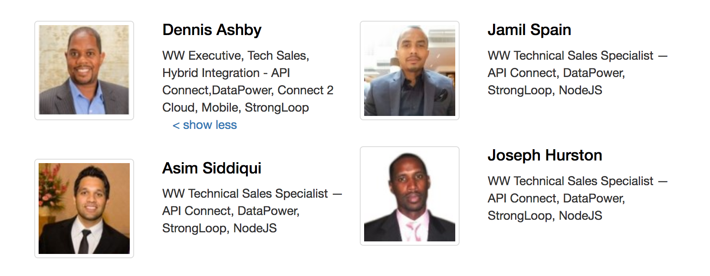

Within, you will explore a series of hands-on labs designed to give you a high-level understanding of the IBM API Connect solution.



## Site Tools
Each section of the guide will identify the persona with which the next few steps relate to, as well as a summary of the tasks you will perform.

Keep an eye out for the tooltips below. These will help guide you through common mistakes, provide tips and helpful context to the task at hand. 













```text
This is a code block. It may hold formatted text or command line instructions.

You can copy the block's content to your clipboard by clicking on the icon to the right. 
```

The environment that you will be working in today utilizes IBM's Bluemix Cloud to host your API Connect service, as well as back-end sample services and a microservice which you will create.

While the main components of the environment are cloud-based, the labs are designed to also make use of the API Connect Developer Toolkit - an application which runs locally on each developer's workstation that provides API design and deploy functionality. 

The prerequisite components have already been installed for you, so please proceed to the [Bluemix Account Setup](acct_setup_overview.html) section.

However, if you are exploring these labs on from your own workstation, you will need to install the Developer Toolkit and it's required components by following the [Environment Setup](env_setup_overview.html) instructions.